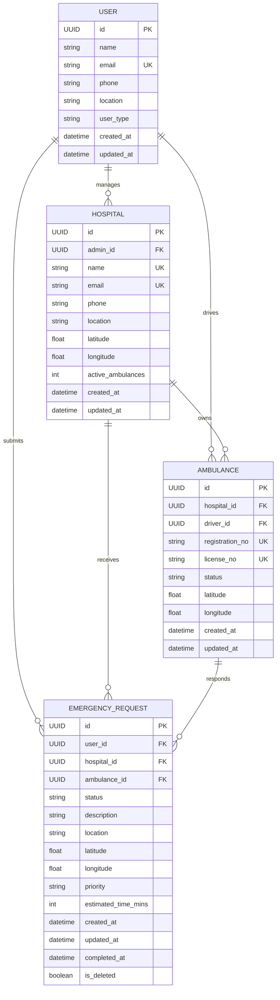
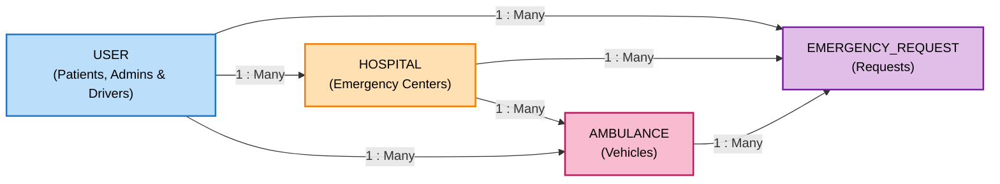
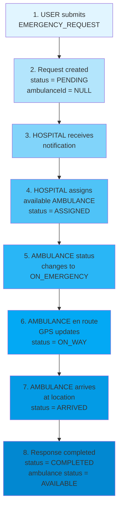

# Database Schema - Emergency Ambulance Request System

This document describes the data model for the Emergency Ambulance Request System, including all entities, their attributes, relationships, and multiplicities.

---

## Entity-Relationship Diagram



---

## Database Table Schema (Detailed View)

### USER Table
| Column          | Type     | Constraint | Description                     |
|-----------------|----------|------------|---------------------------------|
| **id**          | UUID     | PK         | Patient/Hospital Admin ID       |
| **hospital_id** | UUID     | FK         | References HOSPITAL             |
| name            | String   | NOT NULL   | Full name                       |
| email           | String   | UNIQUE     | Email address                   |
| phone           | String   | NOT NULL   | Contact number                  |
| location        | String   | NOT NULL   | Home/Hospital address           |
| user_type       | Enum     | NOT NULL   | PATIENT, HOSPITAL_ADMIN, DRIVER |
| uuid            | String   | UNIQUE     | Application-level identifier    |
| created_at      | DateTime | NOT NULL   | Account creation                |
| updated_at      | DateTime | NOT NULL   | Last update                     |

### HOSPITAL Table
| Column            | Type     | Constraint | Description                   |
|-------------------|----------|------------|-------------------------------|
| **id**            | UUID     | PK         | Hospital ID                   |
| **admin_id**      | UUID     | FK         | References USER (admin)       |
| name              | String   | UNIQUE     | Hospital name                 |
| email             | String   | UNIQUE     | Hospital email                |
| phone             | String   | NOT NULL   | Hospital contact              |
| location          | String   | NOT NULL   | Hospital address              |
| latitude          | Float    | NULLABLE   | GPS latitude                  |
| longitude         | Float    | NULLABLE   | GPS longitude                 |
| uuid              | String   | UNIQUE     | Application-level identifier  |
| active_ambulances | Integer  | DEFAULT 0  | Count of available ambulances |
| created_at        | DateTime | NOT NULL   | Registration date             |
| updated_at        | DateTime | NOT NULL   | Last update                   |

### AMBULANCE Table
| Column          | Type     | Constraint | Description                      |
|-----------------|----------|------------|----------------------------------|
| **id**          | UUID     | PK         | Ambulance ID                     |
| **hospital_id** | UUID     | FK         | References HOSPITAL              |
| **driver_id**   | UUID     | FK         | References USER (driver)         |
| registration_no | String   | UNIQUE     | Vehicle plate number             |
| license_no      | String   | UNIQUE     | Service license number           |
| status          | Enum     | NOT NULL   | AVAILABLE, ON_EMERGENCY, OFFLINE |
| latitude        | Float    | NOT NULL   | Current GPS latitude             |
| longitude       | Float    | NOT NULL   | Current GPS longitude            |
| created_at      | DateTime | NOT NULL   | Registration date                |
| updated_at      | DateTime | NOT NULL   | Last location update             |

### EMERGENCY_REQUEST Table
| Column | Type | Constraint | Description |

|--------|------|-----------|-------------|
| **id** | UUID | PK | Request ID |
| **user_id** | UUID | FK | References USER (patient) |
| **hospital_id** | UUID | FK | References HOSPITAL |
| **ambulance_id** | UUID | FK | References AMBULANCE (nullable) |
| status | Enum | NOT NULL | PENDING, ASSIGNED, ON_WAY, ARRIVED, COMPLETED |
| description | String | NOT NULL | Medical emergency details |
| location | String | NOT NULL | Emergency location address |
| latitude | Float | NULLABLE | Emergency GPS latitude |
| longitude | Float | NULLABLE | Emergency GPS longitude |
| priority | Enum | NOT NULL | LOW, MEDIUM, HIGH, CRITICAL |
| estimated_time_mins | Integer | NULLABLE | ETA in minutes |
| created_at | DateTime | NOT NULL | Request submission |
| updated_at | DateTime | NOT NULL | Last status update |
| completed_at | DateTime | NULLABLE | Completion time |
| is_deleted | Boolean | DEFAULT false | Soft delete flag |

---

## Relationships Visualization



---

## Field Definitions and Scope

### Application-Level Identifiers
The `uuid` field is an **application-level identifier** (not the primary database key). It provides a secondary unique identifier for:
- External API integrations
- Data synchronization across systems
- Human-readable references

The actual database primary key is the `id` field (UUID data type).

---

## Detailed Entity Definitions

### 1. USER (Patients, Admins & Drivers)

**Purpose:** Represents all system users - patients who submit emergency requests, hospital admins who manage operations, and ambulance drivers who respond to emergencies.

**User Types:**
- `PATIENT` - End-users who submit emergency requests
- `HOSPITAL_ADMIN` - Hospital staff who manage ambulances and requests
- `DRIVER` - Ambulance drivers who operate vehicles and respond to emergencies

| Attribute | Type | Constraints | Description |

|-----------|------|-------------|-------------|
| `id` | UUID | PK | Unique identifier for the user |
| `name` | String | NOT NULL | Full name of the user |
| `email` | String | NOT NULL, UNIQUE | Email address for authentication |
| `phone` | String | NOT NULL | Contact phone number |
| `location` | String | NOT NULL | Home or residential address |
| `user_type` | Enum | NOT NULL | PATIENT, HOSPITAL_ADMIN, DRIVER |
| `uuid` | String | UNIQUE | Alternative unique identifier |
| `createdAt` | DateTime | NOT NULL | Account creation timestamp |
| `updatedAt` | DateTime | NOT NULL | Last update timestamp |

**Constraints:**
- Email must be unique across all users
- Phone number format validation (international)
- Location must not be empty
- User type must be one of the defined enum values

---

### 2. HOSPITAL

**Purpose:** Represents hospitals registered in the system that manage ambulances and respond to emergency requests.

| Attribute           | Type     | Constraints      | Description                               |
|---------------------|----------|------------------|-------------------------------------------|
| `id`                | UUID     | PK               | Unique identifier for the hospital        |
| `admin_id`          | UUID     | FK, NOT NULL     | References the USER hospital admin        |
| `name`              | String   | NOT NULL, UNIQUE | Official hospital name                    |
| `email`             | String   | NOT NULL, UNIQUE | Hospital contact email for authentication |
| `phone`             | String   | NOT NULL         | Hospital main phone number                |
| `location`          | String   | NOT NULL         | Full address of the hospital              |
| `latitude`          | Float    | NULLABLE         | GPS latitude coordinate                   |
| `longitude`         | Float    | NULLABLE         | GPS longitude coordinate                  |
| `uuid`              | String   | UNIQUE           | Alternative unique identifier             |
| `active_ambulances` | Integer  | DEFAULT 0        | Count of currently available ambulances   |
| `createdAt`         | DateTime | NOT NULL         | Hospital registration timestamp           |
| `updatedAt`         | DateTime | NOT NULL         | Last update timestamp                     |

**Constraints:**
- `admin_id` must reference an existing USER with `user_type = HOSPITAL_ADMIN`
- Hospital name must be unique
- Email must be unique across all hospitals
- If GPS coordinates provided, both latitude and longitude must be present
- Location must not be empty

---

### 3. AMBULANCE

**Purpose:** Represents ambulances managed by hospitals. Each ambulance is assigned to a driver and receives emergency requests while updating its availability status.

| Attribute | Type | Constraints | Description |

|-----------|------|-------------|-------------|
| `id` | UUID | PK | Unique identifier for the ambulance |
| `hospitalId` | UUID | FK, NOT NULL | References the managing HOSPITAL |
| `driverId` | UUID | FK, NOT NULL | References the DRIVER (USER with type=DRIVER) |
| `registrationNo` | String | NOT NULL, UNIQUE | Vehicle registration/license plate number |
| `licenseNo` | String | NOT NULL, UNIQUE | Ambulance service license number |
| `status` | Enum | NOT NULL | Current status of the ambulance |
| `latitude` | Float | NOT NULL | Current GPS latitude |
| `longitude` | Float | NOT NULL | Current GPS longitude |
| `createdAt` | DateTime | NOT NULL | Ambulance registration timestamp |
| `updatedAt` | DateTime | NOT NULL | Last update timestamp |

**Status Values:**
- `AVAILABLE` - Ambulance is ready to respond
- `ON_EMERGENCY` - Currently responding to a request
- `OFFLINE` - Not operational

**Constraints:**
- `hospitalId` must reference an existing HOSPITAL
- `driverId` must reference an existing USER with user_type = DRIVER
- Registration number and license number must be unique
- Status must be one of the defined enum values
- GPS coordinates must be valid decimal values

**Relationships:**
- `Many : 1` with HOSPITAL (Multiple ambulances managed by one hospital)
- `Many : 1` with USER (Multiple ambulances can be assigned to different drivers)
- `1 : Many` with EMERGENCY_REQUEST (One ambulance can respond to multiple requests over time, but only one active request)

---

### 4. EMERGENCY_REQUEST

**Purpose:** Represents emergency requests submitted by users and tracked through to completion.

| Attribute | Type | Constraints | Description |

|-----------|------|-------------|-------------|
| `id` | UUID | PK | Unique identifier for the request |
| `userId` | UUID | FK, NOT NULL | References the USER who submitted the request |
| `hospitalId` | UUID | FK, NOT NULL | References the HOSPITAL receiving the request |
| `ambulanceId` | UUID | FK, NULLABLE | References the AMBULANCE assigned (NULL until assigned) |
| `status` | Enum | NOT NULL | Current status of the request |
| `description` | String | NOT NULL | Medical emergency description |
| `location` | String | NOT NULL | Location of the emergency |
| `latitude` | Float | NULLABLE | GPS latitude of emergency location |
| `longitude` | Float | NULLABLE | GPS longitude of emergency location |
| `priority` | Enum | NOT NULL | Severity level of the emergency |
| `createdAt` | DateTime | NOT NULL | Request submission timestamp |
| `updatedAt` | DateTime | NOT NULL | Last status update timestamp |
| `completedAt` | DateTime | NULLABLE | Request completion timestamp (NULL if incomplete) |

**Status Progression:**
- `PENDING` - Submitted but not yet assigned to an ambulance
- `ASSIGNED` - Ambulance has been assigned
- `ON_WAY` - Ambulance is en route to patient location
- `ARRIVED` - Ambulance has arrived at emergency location
- `COMPLETED` - Emergency response completed

**Priority Levels:**
- `LOW` - Non-urgent (triage, minor injuries)
- `MEDIUM` - Moderate urgency (chest pain, moderate injuries)
- `HIGH` - Severe/urgent (severe bleeding, difficulty breathing)
- `CRITICAL` - Life-threatening (cardiac arrest, severe trauma)

**Constraints:**
- `userId` must reference an existing USER
- `hospitalId` must reference an existing HOSPITAL
- `ambulanceId` can be NULL (during PENDING status)
- Status must follow the defined progression
- Priority must be one of the defined enum values
- GPS coordinates must be valid if provided
- `completedAt` should only be set when status is COMPLETED

**Relationships:**
- `Many : 1` with USER (A user can submit multiple requests)
- `Many : 1` with HOSPITAL (A hospital receives multiple requests)
- `Many : 1` with AMBULANCE (An ambulance responds to multiple requests over time)

---

---

## Data Flow / Process Timeline

### Emergency Request Lifecycle



---

## Database Indexes (Performance Optimization)

**Recommended Indexes:**

```sql
-- User searches
CREATE INDEX idx_user_email ON USER(email);
CREATE INDEX idx_user_phone ON USER(phone);

-- Hospital searches
CREATE INDEX idx_hospital_email ON HOSPITAL(email);
CREATE INDEX idx_hospital_location ON HOSPITAL(location);

-- Ambulance lookups
CREATE INDEX idx_ambulance_hospitalId ON AMBULANCE(hospitalId);
CREATE INDEX idx_ambulance_status ON AMBULANCE(status);
CREATE INDEX idx_ambulance_registrationNo ON AMBULANCE(registrationNo);

-- Emergency request queries
CREATE INDEX idx_request_userId ON EMERGENCY_REQUEST(userId);
CREATE INDEX idx_request_hospitalId ON EMERGENCY_REQUEST(hospitalId);
CREATE INDEX idx_request_ambulanceId ON EMERGENCY_REQUEST(ambulanceId);
CREATE INDEX idx_request_status ON EMERGENCY_REQUEST(status);
CREATE INDEX idx_request_priority ON EMERGENCY_REQUEST(priority);
CREATE INDEX idx_request_createdAt ON EMERGENCY_REQUEST(createdAt DESC);
CREATE INDEX idx_request_userId_status ON EMERGENCY_REQUEST(userId, status);
CREATE INDEX idx_request_hospitalId_status ON EMERGENCY_REQUEST(hospitalId, status);
```

---

## Version History

| Version | Date | Changes |
|---------|------|---------|
| 1.0 | 2026-03-26 | Initial schema definition with 4 core entities |

